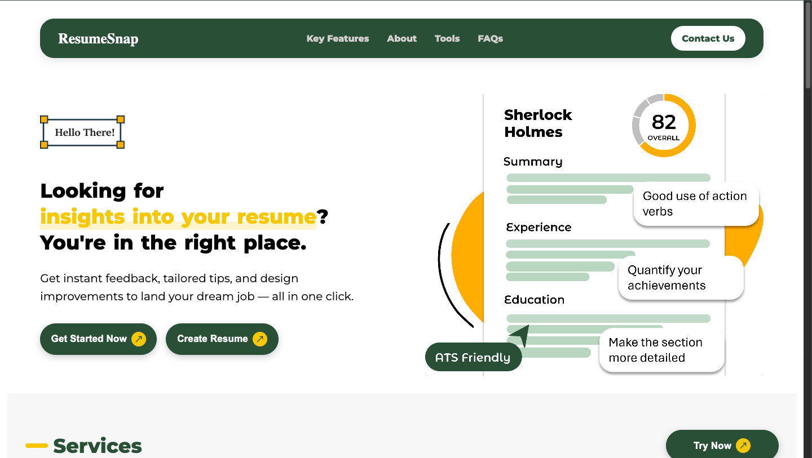
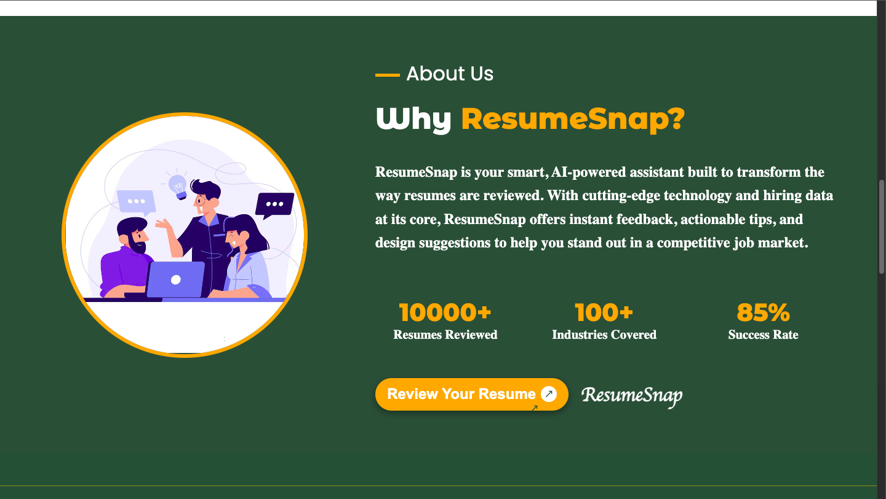
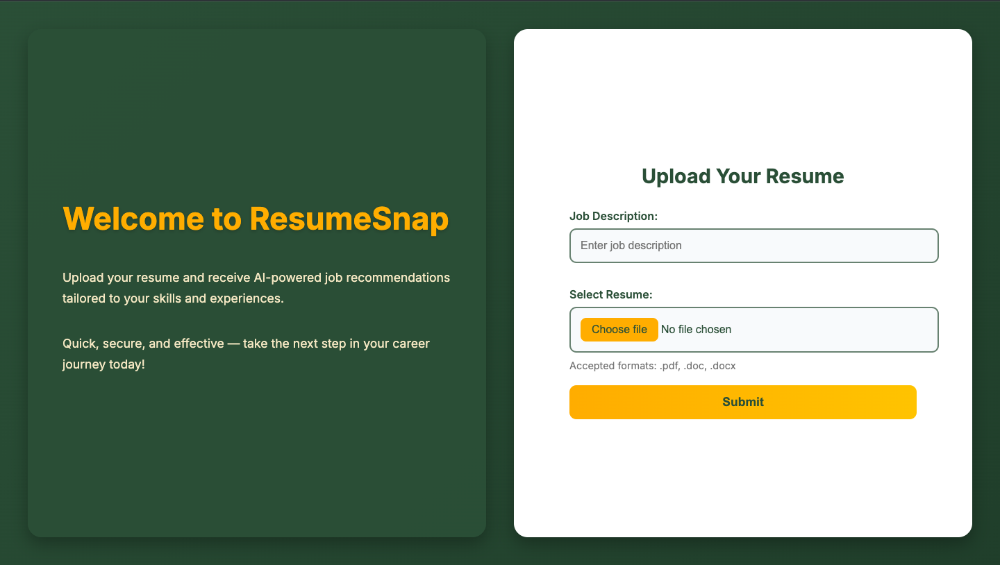

# 💼 Resume Analyzer & Job Recommender

An intelligent web application that extracts resume details, analyzes them based on job descriptions, provides improvement suggestions, scores the resume, and recommends matching job listings.

---

## 👥 Team: Black Ops

**Members:**
- Nakul Verma
- Om Kumar
- Piyush Kumar
- Kartik Yadav

---

## 🚀 Features

- Upload resumes (Image, PDF, DOCX)
- Extract text using OCR and NLP
- Score resumes based on job descriptions
- Identify strengths and weaknesses
- Suggest personalized resume improvements
- Find job listings based on extracted skillsets and input roles
- Store data in a MySQL database

---

## 🛠️ Tech Stack

- **Backend:** Python, Flask, Java, JavaScript
- **Frontend:** HTML, CSS (Jinja Templates), Bootstrap, JavaScript
- **NLP Models:** Custom + Pretrained (spaCy, transformers)
- **Database:** MySQL, Dictionary
- **Libraries:** PyMuPDF, Eassyocr, spaCy, requests

---

## 📸 Screenshots






---

## 🎥 Demo Video

👉 [Click here to watch the demo video](https://drive.google.com/file/d/1ZmTgWnaG1tBSCNxlkzoaDCeKYGoKhOjr/view?usp=sharing)


---

## 🔧 How to Run Locally

1. **Clone the repository:**
    ```bash
    git clone https://github.com/nakul-verma2/resumesnap.git
    cd resumesnap
    ```
<!--  -->
2. **Install dependencies:**
    ```bash
    pip install -r requirements.txt
    ```

3. **Run the Flask app:**
    ```bash
    python main.py
    ```

5. **Open your browser and navigate to:**
    ```
    http://localhost:5000
    ```

---

## 📬 Contact

If you have any queries or feedback, feel free to reach out to any of the team members or raise an issue on the repository.
